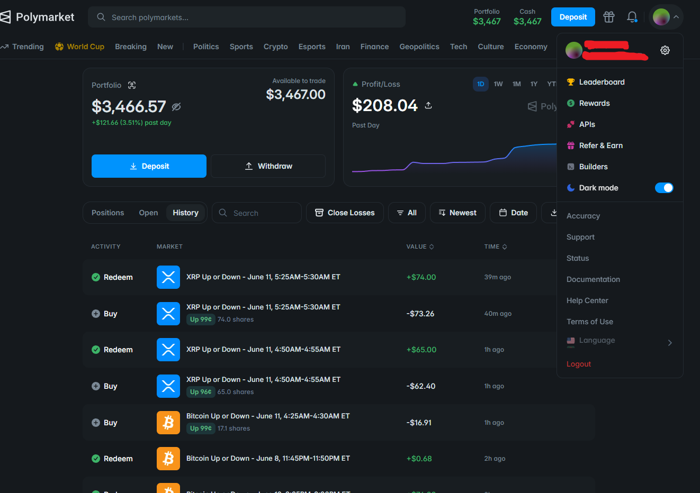

# Polymarket 交易机器人 | Polymarket 套利机器人工具与服务

**语言 / Language / Язык:** [English](README.md) | 中文 | [Русский](README.ru.md)

专业的 **Polymarket 套利机器人工具与服务**，面向自动化交易 **真实世界事件市场** — 不局限于加密货币。

我构建、部署并支持可扫描与交易 **政治、天气、体育、加密、经济、娱乐等** 类别的 Polymarket 机器人。只要 Polymarket 上有 YES/NO 或多结果事件市场，就能接入同一套利栈：发现错价 → 风险定仓 → CLOB 执行 → 结算赎回。

<!-- IMAGE PLACEHOLDER: 宽幅主视觉 Banner。多市场拼贴（选举、NBA、飓风、美联储、BTC）+ 标题 “Polymarket Arbitrage Bot Tools & Services”。深色专业风。建议文件: doc/banner.png -->

**实盘主页：** [**@moond on Polymarket**](https://polymarket.com/@moond)

**Telegram：** [@cryptomoonday23](https://t.me/cryptomoonday23) · **Discord：** cryptomoonday · **作者：** [@cryptomoonday](https://github.com/cryptomoonday)

---

## 我们覆盖的市场

主流 Polymarket 类别均可提供机器人工具与定制服务：

| 类别 | 示例市场 | 典型机器人重点 |
|------|----------|----------------|
| **政治** | 选举、初选、提名、立法、地缘政治 | 嵌套逻辑套利、民调/新闻滞后、多结果打包 |
| **体育** | NBA / NFL / 足球独赢、让分、系列赛、杯赛 | 实时组合套利、独赢↔让分、尾盘狙击 |
| **天气** | 气温阈值、风暴、飓风、降雨 | 模型 vs 市场套利、预报更新后快速重定价 |
| **加密** | 价格阈值、Up/Down 窗口、ETF / 协议事件 | 延迟/预言机滞后、尾盘热门、互补套利 |
| **经济 / 宏观** | 降息、CPI、失业率、GDP | 日历催化剂、跨市场相关对冲 |
| **商业 / 科技** | 财报、产品发布、并购、IPO 赔率 | 新闻速度信息套利、头条后失衡 |
| **文化 / 娱乐** | 颁奖、票房、热点事件 | 薄盘套利、散户过度反应、做市价差 |
| **世界 / 其他** | 冲突时间线、科学、定制事件合约 | 约束套利、结算规则优势、长周期做市 |

<!-- IMAGE PLACEHOLDER: 8 宫格品类卡片（政治、体育、天气、加密、宏观、商业、文化、世界）。建议文件: doc/markets-grid.png -->
<!--  -->

---

## 我提供什么（工具与服务）

- 面向二元 + 多结果市场的 **现成套利机器人模块**
- 按你的赛道定制策略（政治、体育直播、天气量化、加密短窗等）
- 监控数百个事件盘口的 **多市场扫描器**（YES+NO / 打包 / 逻辑缺口）
- **执行 + 风控层** — 滑点上限、库存限制、自动赎回
- **监控与提醒**（Telegram）：成交、跳过、回撤、结算
- **咨询**：架构、VPS/RPC、钱包、策略选型

<!-- IMAGE PLACEHOLDER: 服务流程：你的资金 → Scan/Filter/Size/Execute/Redeem → 各品类市场。建议文件: doc/services-pipeline.png -->
<!--  -->

无论你要 **单一品类** 机器人，还是 **跨全站垂直领域** 的组合栈，欢迎 Telegram 联系：[@cryptomoonday23](https://t.me/cryptomoonday23)，或 Discord：**cryptomoonday**。

---

## 功能亮点

- 面向 **事件驱动** 的 Polymarket 市场：政治、体育、天气、加密等
- 核心优势：**互补套利**、**多结果打包套利**、**逻辑/嵌套套利**、**做市**、**信息/催化剂滞后**、**尾盘热门**
- 实时 CLOB 监控 + Polygon 上自动买入 → 合并/赎回
- 可配置宇宙：指定 slug、标签或整类市场
- 公开主页实盘证明
- 按品类划分的策略手册，便于理解政治 vs 体育 vs 天气 vs 加密的差异

---

## 策略目录（跨市场）

| # | 策略 | 更适合 | 典型优势 |
|---|------|--------|----------|
| 1 | **二元互补套利** | 所有二元市场 | 合并卖价 < $1 时买 YES+NO |
| 2 | **多结果打包套利** | 选举、奖项、多候选 | 全结果集合价 < $1 |
| 3 | **逻辑 / 嵌套套利** | 政治、地缘 | 相关市场违反概率约束 |
| 4 | **体育组合套利** | NBA/NFL 独赢+让分 | 直播中跨合约错价 |
| 5 | **天气模型套利** | 气温 / 风暴市场 | 外部预报模型 vs Polymarket 赔率 |
| 6 | **加密延迟 / 预言机套利** | 短周期 Up/Down | 现货先动、市场后跟 |
| 7 | **尾盘 / 热门研磨** | 晚期政治、尾盘体育、加密窗口 | 结算前买入高概率热门 |
| 8 | **阶梯 / 101¢ 做市** | 流动性好的事件盘 | 吃价差 / 配对卖出 > $1 |
| 9 | **阶梯出场** | 双边库存策略 | 结算前流动性感知平仓 |
| 10 | **催化剂 / 新闻滞后套利** | 政治、宏观、商业 | 在人群完成重定价前交易 |
| 11 | **失衡套利** | 薄盘文化 / 小众事件 | 买入暂时便宜的一侧 |
| 12 | **跨平台 / 相关对冲** | 政治+宏观+加密集群 | 相关事件作为篮子交易 |

<!-- IMAGE PLACEHOLDER: 12 策略瓦片图，带品类标签。建议文件: doc/strategy-catalog.png -->
<!--  -->

---

## 联系方式

我提供覆盖多品类的 **Polymarket 套利机器人工具与服务**。政治扫描、体育直播组合引擎、天气模型叠加、加密短窗模块，或完整多品类栈 — 都可以设计、交付与调优。

| 渠道 | 链接 |
|------|------|
| **Telegram** | [@cryptomoonday23](https://t.me/cryptomoonday23) |
| **Discord** | cryptomoonday |
| **GitHub** | [@cryptomoonday](https://github.com/cryptomoonday) |
| **Polymarket** | [@moond](https://polymarket.com/@moond) |

公开实盘账户：

**https://polymarket.com/@moond**

<!-- IMAGE PLACEHOLDER: 联系 CTA — Telegram @cryptomoonday23 + Discord cryptomoonday + Polymarket @moond。建议文件: doc/contact-cta.png -->
<!--  -->

---

## 实盘证明

来自 [@moond](https://polymarket.com/@moond) 的自动买入 → 赎回与组合活动。同一结算闭环适用于各类事件市场：政治、体育、天气、加密等。

<!-- IMAGE PLACEHOLDER: @moond 主页完整截图（盈亏曲线 + 多品类持仓）。建议文件: doc/moond-profile.png -->
<!--  -->

### 链上买入 → 赎回示例

Polygon 真实交易，展示机器人结算模式：**买入结果份额 → 结算后按 $1.00 赎回**。

<!-- IMAGE PLACEHOLDER: 买入与赎回 Polygonscan 并排截图。建议文件: doc/onchain-buy-redeem.png -->

#### 交易 1 — 2026年6月11日 · 约 $0.99 入场

| 步骤 | 时间 (UTC) | 详情 | Polygonscan |
|------|------------|------|-------------|
| **买入** | 09:30:01 | 约 **$67.32** USDC → **68 股** @ **~$0.99** | [查看买入](https://polygonscan.com/tx/0x6874a18bcd84c18a6e9d5cffd0a94eb0bdc148089a364370eb9120384bc4e21c) |
| **赎回** | 09:31:03 | 市场结算 → 每股赎回约 **$1.00** | [查看赎回](https://polygonscan.com/tx/0x17e8fbc7ed8d995c44127da034e487733a43f18c6638cdcba9088a519b11ad63) |

**约毛利：** 约 **$0.68**（约 $67 本金，约 **1%**），约 **62 秒**（未计费用）。

#### 交易 2 — 2026年6月11日 · 约 $0.99 入场

| 步骤 | 时间 (UTC) | 详情 | Polygonscan |
|------|------------|------|-------------|
| **买入** | 08:55:01 | 接近结算买入热门 @ **~$0.98–$0.99** | [查看买入](https://polygonscan.com/tx/0x7fa58be45dc24afbc8bd135fc6a7147fb548e2c00ad2f5b6100fa7510dd58b45) |
| **赎回** | 08:55:30 | 买入后约 **29 秒** 结算赎回 | [查看赎回](https://polygonscan.com/tx/0x4edaaa3a6a6d854fe6ec938280ab3cfd34d07f34fcc75c7f4757feccfc9d30dc) |

> **如何阅读：** **买入** 与 `Polymarket: CTF Exchange V2` 交互。**赎回** 将获胜份额按 **$1.00** 换回 USDC。同一管线适用于选举、比赛、天气阈值与加密事件 — 变化的是信号层。

### 主页与活动截图

<!-- IMAGE PLACEHOLDER: @moond 日盈亏 / 组合增长图。建议文件: doc/daily_pnl.png -->

<!-- IMAGE PLACEHOLDER: 混合品类持仓列表（政治+体育+天气等）。建议文件: doc/positions-mixed.png -->
<!--  -->

<!-- IMAGE PLACEHOLDER: 多事件已结算交易历史表。建议文件: doc/trade-history.png -->
<!--  -->

### 资金流、合并与奖励图库

机器人栈支持的完整 Polymarket 资金闭环截图 — **充值 / 提现**、**合并 (merge)**、**流动性与持仓奖励**、**maker / taker 返佣**。请把图片放到 `doc/`，文件名如下。

| 操作 | 应截取的内容 | 文件 |
|------|--------------|------|
| **Deposit（充值）** | 钱包 / Polymarket 充值 USDC（或跨链）成功界面 | `doc/deposit.png` |
| **Withdraw（提现）** | 提现 / 出金确认界面 | `doc/withdraw.png` |
| **Merge（合并）** | 将 YES+NO（或配对库存）合并回 USDC | `doc/merge.png` |
| **Liquidity rewards** | 流动性奖励 / LP 激励面板或领取记录 | `doc/liquidity-rewards.png` |
| **Holding rewards** | 持仓奖励面板或发放记录 | `doc/holding-rewards.png` |
| **Maker rebate** | Maker 返佣收益 | `doc/maker-rebate.png` |
| **Taker rebate** | Taker 返佣收益（如适用） | `doc/taker-rebate.png` |

#### 充值与提现

<table>
<tr>
<td width="50%" valign="top">

**Deposit（充值）**

<!-- IMAGE PLACEHOLDER: Polymarket 或钱包充值界面 — USDC 入账金额 + 成功状态。裁剪紧凑，隐藏私钥。建议文件: doc/deposit.png -->

</td>
<td width="50%" valign="top">

**Withdraw（提现）**

<!-- IMAGE PLACEHOLDER: 提现 / 出金界面 — USDC 出账金额 + 成功状态。建议文件: doc/withdraw.png -->

</td>
</tr>
</table>

#### 合并（Merge）

<!-- IMAGE PLACEHOLDER: Merge 界面或链上 merge 交易 — 将配对 YES+NO（或完整结果集）库存换回 USDC。尽量展示合并前后余额。建议文件: doc/merge.png -->

#### 流动性奖励与持仓奖励

<table>
<tr>
<td width="50%" valign="top">

**Liquidity rewards**

<!-- IMAGE PLACEHOLDER: 流动性奖励面板 — LP 激励收益、领取按钮或奖励历史。建议文件: doc/liquidity-rewards.png -->

</td>
<td width="50%" valign="top">

**Holding rewards**

<!-- IMAGE PLACEHOLDER: 持仓奖励面板 — 持有结果代币/仓位的奖励、领取或历史视图。建议文件: doc/holding-rewards.png -->

</td>
</tr>
</table>

#### Maker 返佣与 Taker 返佣

<table>
<tr>
<td width="50%" valign="top">

**Maker rebate**

<!-- IMAGE PLACEHOLDER: Maker 返佣面板 — 挂单/限价（maker）成交的费用返还；标出返佣金额与周期。建议文件: doc/maker-rebate.png -->

</td>
<td width="50%" valign="top">

**Taker rebate**

<!-- IMAGE PLACEHOLDER: Taker 返佣面板 — 吃单（taker）成交的费用返还（若账户/计划有显示）；标出返佣金额与周期。建议文件: doc/taker-rebate.png -->

</td>
</tr>
</table>

---

## 为什么 2026 年多市场 Polymarket 套利很重要

Polymarket 已不只是「加密 Up/Down」。成交与低效出现在：

- **选举与政治** — 嵌套州/全国市场产生逻辑约束
- **体育** — 独赢 vs 让分/组合盘在直播中错价
- **天气** — 模型交易者 vs 休闲散户赔率
- **宏观与商业** — 日历数据与头条驱动脉冲行情
- **加密** — 仍是延迟与短窗优势的重要垂直领域

2025–2026 研究与行业文章反复强调：

- 通过对相关条件建模，可从 **数学/约束套利** 中大规模提取
- **多结果打包** 在卖价之和 < $1 时出现缺口
- 体育上可执行组合套利常集中在 **比赛最后几分钟**，深度是规模瓶颈
- 纯缺口压缩到秒级；机器人胜在 **扫描速度 + 品类逻辑 + 风控上限**

<!-- IMAGE PLACEHOLDER: 「按品类的 Polymarket 成交量」图。建议文件: doc/volume-by-category.png -->
<!--  -->

---

## 核心策略手册（适用各类事件）

### 1. 二元互补套利（YES + NO < $1）

适用于 **任意** 二元事件。若 `ask_YES + ask_NO < 1.00`（计入费用/缓冲后），买入双边并在结算锁定结构性利润。

<!-- IMAGE PLACEHOLDER: YES 0.48 + NO 0.50 = 0.98 → 锁定 $0.02 示意图。建议文件: doc/diagram-complement-arb.png -->
<!--  -->

### 2. 多结果打包套利

多候选/多队/多区间市场中，若所有互斥结果最便宜卖价之和 **低于 $1**，买入全套。

### 3. 逻辑 / 嵌套 / 相关套利

相关市场必须服从约束；机器人将价格投影到有效概率集合并对违规交易。

<!-- IMAGE PLACEHOLDER: 政治相关市场网络图，标红约束冲突边。建议文件: doc/diagram-logical-arb.png -->
<!--  -->

### 4. 阶梯 / 101¢ 做市 + 阶梯出场

提供流动性或按合计 **≥ ~$1.01** 卖出 YES+NO，结算前用阶梯逻辑平仓。

### 5. 催化剂 / 信息滞后

民调、伤病、预报更新、CPI、突发新闻到来时，机器人与人群重定价赛跑。

### 6. 尾盘 / 高概率热门

接近结算时在 **0.95–0.99** 区间买入热门（晚期选举、垃圾时间体育、已锁定天气、加密短窗等）。

---

## 按市场品类的策略

### 政治

- 扫描嵌套选举/提名/立法市场的 **逻辑冲突**
- 多候选打包套利（sum(asks) < $1）
- 交易 **民调与新闻滞后**（可选 AI 公允赔率）
- 在流动全国盘做市；对薄州级盘谨慎狙击

<!-- IMAGE PLACEHOLDER: 选举市场集群截图。建议文件: doc/politics-markets.png -->
<!--  -->

<!-- IMAGE PLACEHOLDER: 政治套利告警终端/面板。建议文件: doc/politics-bot-alert.png -->
<!--  -->

---

### 体育

- 监控 **独赢 ↔ 让分/总分** 关系做组合套利（NBA 类盘口文献较多）
- 聚焦 **直播尾盘** 赔率剧烈波动时的缺口
- 按 **盘口深度** 定仓 — 体育套利常受流动性限制
- 比赛结果接近确定时可选尾盘狙击

<!-- IMAGE PLACEHOLDER: 直播体育盘 + 独赢/让分不一致高亮。建议文件: doc/sports-combinatorial.png -->
<!--  -->

<!-- IMAGE PLACEHOLDER: 开赛→直播→末段套利区时间线。建议文件: doc/sports-timeline.png -->
<!--  -->

---

### 天气

- 将 Polymarket 天气赔率与 **外部预报模型** 对比
- 在模型更新周期上比休闲玩家更快重定价
- 对气温区间市场做互补/打包套利

<!-- IMAGE PLACEHOLDER: 左气象模型图 / 右 Polymarket 气温市场，标出优势。建议文件: doc/weather-model-vs-market.png -->
<!--  -->

---

### 加密（仍支持 — 但不是唯一重点）

- 短 Up/Down 窗口的 **延迟 / 预言机** 玩法
- YES+NO 暂时和 < $1 的 **互补套利**
- 窗口末 **尾盘热门**
- 流动加密事件盘上的做市 / 阶梯模块

<!-- IMAGE PLACEHOLDER: 加密 Up/Down 盘 + 现货滞后示意。建议文件: doc/crypto-latency.png -->
<!--  -->

---

### 经济、商业与宏观

- 围绕 **预定数据**（美联储、CPI、非农）布局与短线
- 财报 / 并购 / 产品市场的头条滞后交易
- 利率、风险资产与政治赔率篮子发散时的相关对冲

<!-- IMAGE PLACEHOLDER: 经济日历叠加 Fed/CPI 市场。建议文件: doc/macro-calendar.png -->
<!--  -->

---

### 文化、娱乐与长尾事件

- 寻找 **薄盘互补/打包** 缺口
- 淡化病毒新闻后的极端散户反应
- 在价差宽、逆向选择可控处做市

<!-- IMAGE PLACEHOLDER: 颁奖/娱乐市场宽买卖价差标注。建议文件: doc/culture-spread.png -->
<!--  -->

---

## 多市场套利栈如何组合

| 层级 | 作用 |
|------|------|
| **宇宙** | 政治 + 体育 + 天气 + 加密 + 宏观 + 其他标签 |
| **结构** | 互补、多结果打包、逻辑约束 |
| **品类叠加** | 体育组合、天气模型、加密延迟、政治嵌套 |
| **执行** | CLOB 限价/FAK、滑点、库存、阶梯出场 |
| **结算** | 跨事件类型自动合并/赎回 |
| **运维** | Telegram 提醒、回撤熔断、分品类风险预算 |

<!-- IMAGE PLACEHOLDER: 多市场套利架构分层图。建议文件: doc/architecture-stack.png -->
<!--  -->

---

## 为什么找我

本项目帮助交易者与运营方获得覆盖全事件光谱的 **Polymarket 套利机器人工具与服务**：

- 不锁死在仅加密策略
- 政治、天气、体育、加密、宏观等 — **全部可用**
- 按品类清晰的策略地图
- 实盘主页：[@moond](https://polymarket.com/@moond)
- 定制构建、扫描器、执行引擎与持续调优

Telegram：[@cryptomoonday23](https://t.me/cryptomoonday23) · Discord：**cryptomoonday**

<!-- IMAGE PLACEHOLDER: 收尾 CTA — “跨所有事件品类的 Polymarket 套利” + Telegram @cryptomoonday23 + Discord cryptomoonday。建议文件: doc/closing-cta.png -->
<!--  -->

---

## 风险与免责声明

- **优势小、尾部大** — 费用、滑点与一次坏成交可抹掉多次盈利
- **竞争激烈** — 许多结构性缺口仅持续数秒
- **品类风险不同** — 体育深度限制规模；政治模型风险真实；天气模型可能出错
- **过往业绩不代表未来** — [@moond](https://polymarket.com/@moond) 仅作示意，非承诺
- **非投资建议** — 预测市场存在重大亏损风险

---

## 路线图

- 更深的政治约束图 + 选举季策略包
- 直播体育组合引擎增强
- 天气模型连接包
- 跨品类组合风险仪表盘
- Telegram 运维套件
- 云部署自动化

---

## SEO 关键词

Polymarket 套利机器人, Polymarket 交易机器人工具, Polymarket 机器人服务, 政治套利 Polymarket, 体育组合套利, 天气交易机器人, 多结果打包套利, 逻辑嵌套套利, 互补套利, Polymarket 做市, 预测市场机器人, 事件市场交易机器人, 选举交易机器人

---

## 许可证

ISC License
